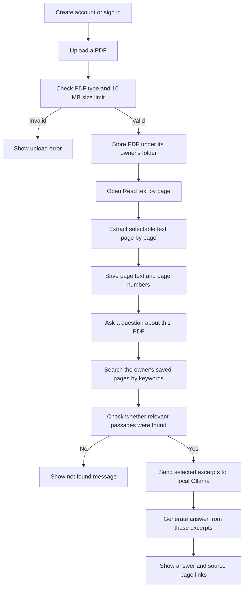

# Docs AI flowchart

This diagram shows the current request flow from a student's account to a cited answer.

```mermaid
flowchart TD
    A[Create account or sign in] --> B[Upload a PDF]
    B --> C[Check PDF type and 10 MB size limit]
    C -- Invalid --> D[Show upload error]
    C -- Valid --> E[Store PDF under its owner's folder]
    E --> F[Open Read text by page]
    F --> G[Extract selectable text page by page]
    G --> H[Save page text and page numbers]
    H --> I[Ask a question about this PDF]
    I --> J[Search the owner's saved pages by keywords]
    J --> K[Check whether relevant passages were found]
    K -- No --> L[Show not found message]
    K -- Yes --> M[Send selected excerpts to local Ollama]
    M --> N[Generate answer from those excerpts]
    N --> O[Show answer and source page links]
```
